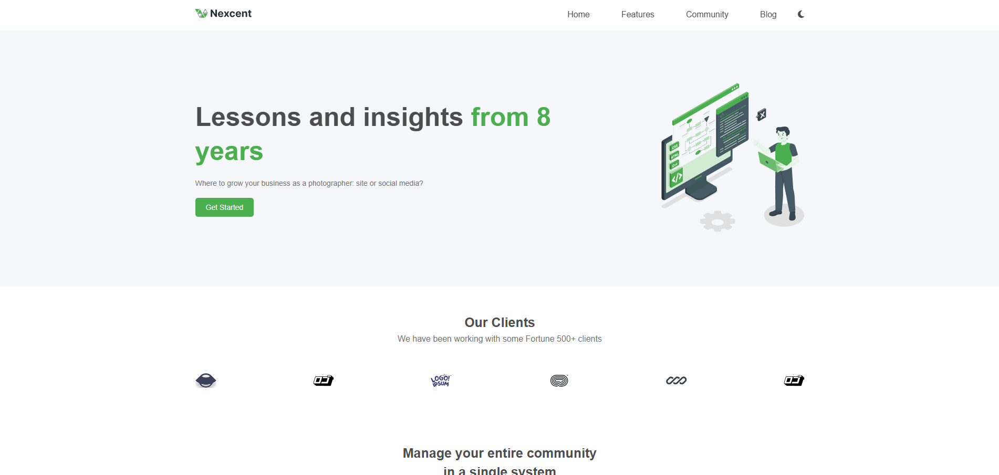

# Nexcent 🌐

## 📝 Project Overview

Nexcent is a modern, responsive frontend web application designed to deliver a sleek and intuitive user experience. With a focus on clean design and seamless functionality, the project showcases the power of contemporary web technologies.

## ✨ Key Features

- **Responsive Design**: Fully adaptable layout across all device types and screen sizes
- **Dark Mode Toggle**: Smooth transition between light and dark color schemes
- **Modern UI/UX**: Clean, minimalist design with intuitive navigation
- **Performance Optimized**: Lightweight and fast-loading web application
- **Cross-Browser Compatibility**: Consistent experience across major web browsers

## 🚀 Demo

[View Live Demo](https://alimohaamed.github.io/Nexcent/) (placeholder link)

## 🛠 Technologies Used

### Frontend
- HTML5
- CSS3
- JavaScript (ES6+)

### Design & Layout
- CSS Flexbox
- CSS Grid
- Media Queries
- Responsive Design Principles

### Additional Tools
- Font Awesome (Icons)

## 🚀 Getting Started

### Prerequisites
- Modern web browser (Chrome, Firefox, Safari, Edge)
- Text editor (VS Code, Sublime Text, etc.)
- Git

## 🔧 Customization

Easy customization options:
- Modify `styles.css` to adjust color palettes
- Update `script.js` to enhance interactivity
- Customize content in `index.html`

## 📱 Responsive Breakpoints

- Mobile: Up to 640px
- Desktop: 1025px and above

### Contribution Guidelines
- Follow existing code style
- Add comments for complex logic
- Write clean, maintainable code
- Include tests for new features

## 🐛 Reporting Issues

Found a bug? Please open an issue with:
- Detailed description
- Steps to reproduce
- Expected vs. actual behavior
- Screenshots (if applicable)

## 🌟 Support

Star the project if you find it useful! Contributions and feedback are always welcome.

---

**Crafted with ❤️ by Ali Mohamed**